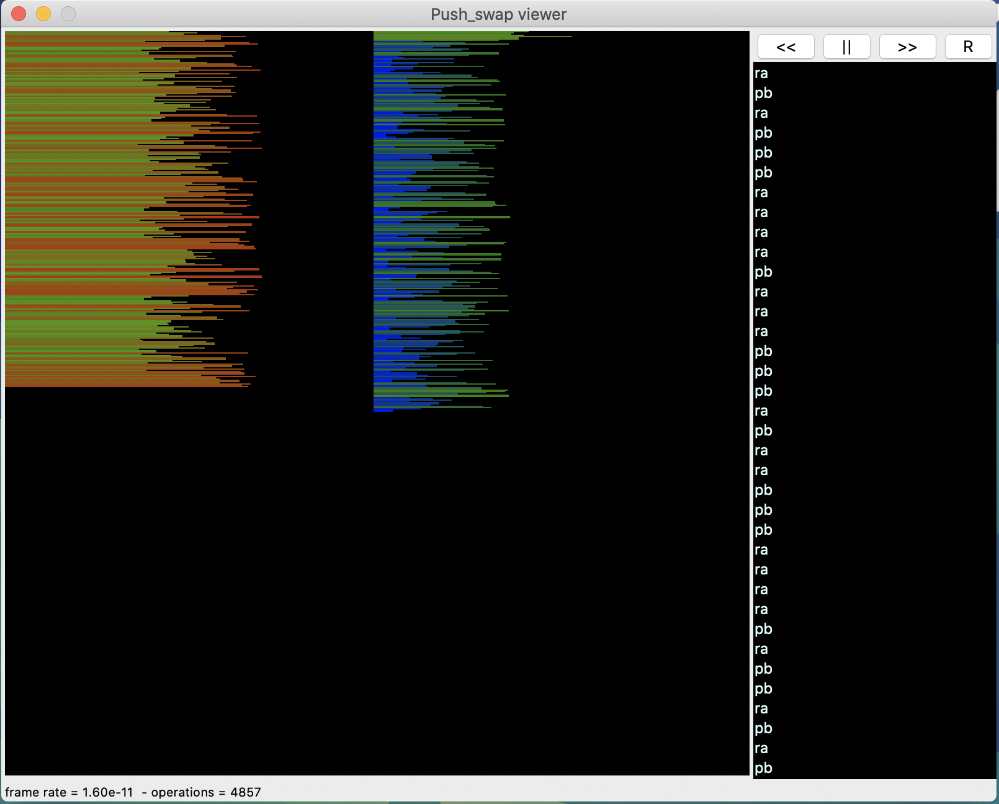
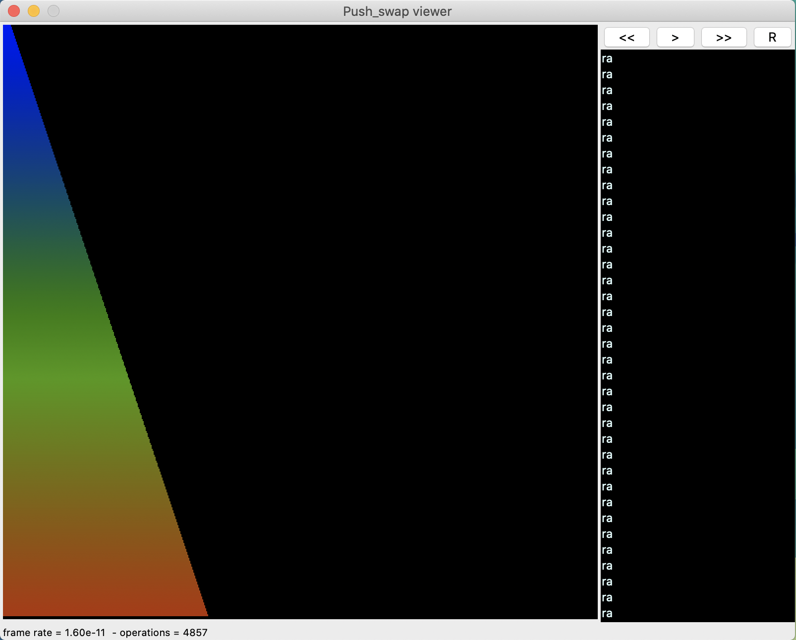

<h1 align="center">
	🧰 42 Project: Push_swap
</h1>

<p align="center">
	<b><i>Because Swap_push isn’t as natural</i></b><br>
</p>

<p align="center">
	
	
	
	
	
</p>

<h3 align="center">
	<a href="#-about-the-project">About</a>
	<span> · </span>
	<a href="#%EF%B8%8F-usage">Usage</a>
	<span> · </span>
  <a href="#usefull-make-command">Usefull Command</a>
	<span> · </span>
	<a href="#-references">References</a>
</h3>

---

## 💡 About the project

> _This project involves sorting data on a stack, with a limited set of instructions, and the smallest number of moves. To make this happen, you will have to manipulate various sorting algorithms and choose the most appropriate solution(s) for optimized data sorting._
### What is push_swap?
This project will make you sort data on a stack, with a limited set of instructions, using the lowest possible number of actions. To succeed you’ll have to manipulate various types of algorithms and choose the most appropriate solution (out of many) for an optimized data sorting..

#### Skills
- Rigor
- Unix
- Algorithms & AI
- Imperative programming


#### My grade


## 🛠️ Usage

**Follow the steps below**

### Instructions

**1. Clone the repository from github**

```bash
git clone https://github.com/abdulazizabduvakhobov/push_swap.git && cd push_swap/
```
**2. Compile the library by Makefile**
To compile the library, go to its path and run:

For all mandatory and bonus functions:

```bash
 make
```

**3. On the same directory run the following command:**
```bash
./push_swap "<random numbers>"
```

**Example of usage**
<p align="center">
  
  
</p>  


### Requirements
The library is written in C language and needs the **`gcc` compiler** and some standard **C libraries** to run.

## Usefull make command

**1. Cleaning all binary (.o) files**

To clean all files generated binary files while doing a make, go to the path and run:

```bash
 make clean
```

**2. Cleaning all binary (.o) and executable files (.a)**

To clean all files generated while doing a make, go to the path and run:

```bash
 make fclean
```

**3. Cleaning all binary (.o) and executable files (.a) in all directories**

To clean all files generated while doing a make, go to the path and run:

```bash
 make ffclean
```

**4. Checking Norminette standart**

To check Norminette errors of all files, simply go to the path and run:

```bash
 make norm
```

**5. Running tester**

To run the tester simply clone tester repository to the same folder below and run:

```bash
 make test
```

**6. Visualizing algorithm**

To visualize the sorting algorithm, simply clone visualizing repository to the same folder below and run:

```bash
 make vis
```

**7. Help command**

To get information about command, run:

```bash
 make help
```

## 📋 Tester and Visualizer
* [Visualizer](https://github.com/o-reo/push_swap_visualizer)
* [Tester](https://github.com/laisarena/push_swap_tester)
